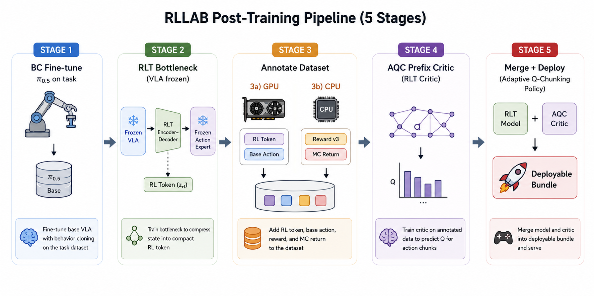

# RSS 2026 — Post-Training for Robot Foundation Models (RLLAB)

A fork of [openpi](https://github.com/Physical-Intelligence/openpi) (π₀.₅ VLA) extended for the
RSS 2026 *Post-Training for Robot Foundation Models* workshop challenge. On top of the standard
behaviour-cloning baseline, this repo adds an **offline-RL fine-tuning stack** built around an
**RL-token bottleneck + adaptive-Q-chunking (AQC) prefix critic**: a lightweight transformer
critic, trained on *precomputed* frozen-VLA latents, that at deployment scores the policy's
candidate action chunks and picks both *which* chunk and *how many steps* to commit.

The three challenge tasks are pre-registered as training configs:
`insert-mouse-battery`, `seal-water-bottle-cap`, `tower-of-hanoi-game` (plus a merged
`generalist`).

---

## Pipeline



Each stage is one root-level launcher (`stageN_*.sh`). The critic (stage 4) reads only the
annotated `rl_token` / `base_action` / `mc_return` columns, so it trains **without any VLA forward
pass** — fast and cheap.

| Stage | What | Command |
|---|---|---|
| 1 | BC fine-tune π₀.₅ on a challenge task | `bash stage1_2_train.sh pi05_<task>_bc_ft` |
| 2 | Train the RL-token bottleneck on the frozen BC policy | `bash stage1_2_train.sh pi05_<task>_rlt_joint` |
| 3a | Annotate `rl_token` + `base_action` (multi-GPU) | `bash stage3a_annotate_rlt_joint.sh` |
| 3b | Annotate reward v3 + `mc_return` | `bash stage3b_annotate_reward.sh <dataset_root>` |
| 4 | Train the AQC prefix critic | `bash stage4_train_critic.sh vla_aqc_warmup 64 <gpu>` |
| 5 | Merge into a deployable bundle, then serve | `bash stage5_merge.sh <rlt_config> <rlt_ckpt> <critic_run> <out>` → deploy |

---

## 0. Install

```bash
git clone --recurse-submodules https://github.com/jellyho/openpi-baseline_RLLAB.git
cd openpi-baseline_RLLAB

GIT_LFS_SKIP_SMUDGE=1 uv sync
GIT_LFS_SKIP_SMUDGE=1 uv pip install -e .
```

Requires an NVIDIA GPU. Full fine-tuning of the 2B π₀.₅ backbone (stages 1–2) needs an 80 GB
GPU; the AQC critic (stage 4) is ~10 M params and fits in <8 GB.

## 1. Configure

**Everything machine-specific lives in one file: [`setup_env.sh`](setup_env.sh).** It is sourced
automatically by every `stageN_*.sh` launcher, and `config.py` / `rlt_critic/config.py` read these
env vars — so the per-config dataset / checkpoint paths **never need hand-editing** when you move
boxes; you only edit `setup_env.sh`.

**Caches**:
```bash
export OPENPI_DATA_HOME=...   # pretrained checkpoint cache
export HF_LEROBOT_HOME=...    # LeRobot dataset cache
export HF_HOME=...            # HuggingFace model cache
```

**Dataset / checkpoint roots** (defaults target the `/data5` box; override per machine).
`config.py` builds every per-config `local_files_path` / `weight_loader` path from these:

| env var | what it points at | default |
|---|---|---|
| `PFR_DATA` | raw / merged / combined LeRobot datasets (`local_files_path`) | `$CACHE_DIR/PFR_RSS/dataset` |
| `PFR_CKPT` | pretrained `pi05` bases the BC configs load from (`rss_ckpt/`) | `$CACHE_DIR/PFR_RSS/checkpoints` |
| `RLT_DATA_BASE` | the AQC critic's annotated datasets (`<task>_annotated`) | `$PFR_DATA/phase1_annotated` |
| `PI_CKPT_DIR` | where stage 1–2 training **writes** (and stage 2 reads its BC init from) | `./checkpoints` |
| `RLT_CRITIC_CKPT_DIR` | where stage 4 critic runs are written | `$CACHE_DIR/PFR_RSS/checkpoints/rlt_critic_runs` |

Cross-stage wiring, handled by these roots automatically:
- a `*_bc_ft` config loads `pi05_base` from `$PFR_CKPT/rss_ckpt/…` and **writes** to `$PI_CKPT_DIR`;
- a `*_rlt[_joint]` config loads the **trained `*_bc_ft` checkpoint** from `$PI_CKPT_DIR`
  (`AlphaFlowWeightLoader`) and **reuses the BC norm stats** (`AssetsConfig`, no recompute);
- the annotate scripts and `stage5_merge.sh` take the trained `*_rlt` **step dir**.

---

## 2. Stage 1 — BC fine-tune

Fine-tune π₀.₅ on a single challenge task (or the merged generalist):

```bash
bash stage1_2_train.sh pi05_insert-mouse-battery_bc_ft   # or _seal-water-bottle-cap_, _tower-of-hanoi-game_, _generalist_
```

`stage1_2_train.sh` sources `setup_env.sh`, runs `scripts/train.py <config> --resume`, and tees logs to
`logs/<config>_<timestamp>.log`. Norm stats are computed once and saved next to the checkpoint
(`params/<asset_id>/norm_stats.json`), making `params/` self-contained for inference.

> Merged **generalist**: concatenate the three task datasets with
> [`scripts/merge_lerobot.py`](scripts/merge_lerobot.py) (see [Appendix](#appendix--merging-datasets)),
> then train `pi05_generalist_bc_ft`.

## 3. Stage 2 — RLT bottleneck

Train the **RL-token bottleneck** ([arXiv:2604.23073](https://arxiv.org/abs/2604.23073)) on top of
the **frozen** BC policy. An encoder–decoder compresses the VLA's prefix image features (+ proprio)
into a compact 2048-d latent `z_rl`; only the `rlt_*` params train (VLA + action expert stay frozen).

```bash
bash stage1_2_train.sh pi05_generalist_rlt_joint   # or pi05_<task>_rlt_joint
```

Two variants:
- **`*_rlt`** (vanilla `Pi0RLT`) — token comes from a *language-free* image-only backbone pass.
- **`*_rlt_joint`** (`Pi0RLTJoint`, **recommended**) — token is sourced from the image-token hidden
  states of the *same* full (image+language) forward used for action sampling, so annotation /
  inference runs the 2B backbone **once** per state instead of twice. The token becomes
  language-conditioned (fine for a generalist). Not checkpoint-compatible with vanilla `Pi0RLT` —
  train fresh.

## 4. Stage 3 — Annotate the dataset

The critic reads four columns from the LeRobot v3.0 dataset. Two annotation passes add them:

**(3a) RL-token + base actions** — uses the trained RLT checkpoint on the GPU. Edit the
`CONFIG` / `CKPT` / `SRC` / `OUT` / `GPUS` variables at the top of the script, then:

```bash
bash stage3a_annotate_rlt_joint.sh   # joint model (single backbone forward); stage3a_annotate_rlt.sh for vanilla
```

It shards files across GPUs (DDP-style: GPU sampling is the bottleneck, data loading is ~100× faster),
writes per-frame columns, and registers the new features in `meta/info.json` once all shards finish.

**(3b) Reward v3 + Monte-Carlo return** — CPU-only, idempotent (skips if already v3):

```bash
bash stage3b_annotate_reward.sh <dataset_root>   # add WORKERS as $2; DRY_RUN=1 for the design summary
```

The annotated columns:

| column | dtype | shape | meaning |
|---|---|---|---|
| `rl_token` | f32 | `[2048]` | frozen-VLA bottleneck latent = critic **state token** |
| `base_action` | f16 | `[32, 50, 14]` | N=32 base-policy **candidate chunks** (raw action space) |
| `reward` | f32 | `[1]` | v3-normalized reward |
| `mc_return` | f32 | `[1]` | v3-normalized return-to-go (γ=0.9999), in `[-1, 0]` |

**v3 reward scheme**: living `−1`/step, success terminal `0`, failure terminal `−0.4·T_max`;
γ=0.9999 return-to-go; globally normalized by `Z = |min return|` so `mc_return ∈ [-1, 0]`. This
makes *steps-to-go* (hence prefix length) informative — the earlier near-flat scheme collapsed the
adaptive-chunking signal.

## 5. Stage 4 — Train the AQC prefix critic

A small causal transformer (`src/openpi/rlt_critic/`) learns the **prefix-conditioned** value
`Q(z_rl, a_{1:h})` for *every* commit length `h` in one forward pass — the signal that lets
deployment pick how many steps to execute.

```bash
# one GPU, foreground (logs to logs/); auto-resumes from the last checkpoint
bash stage4_train_critic.sh vla_aqc_warmup 64 <gpu>            # CONFIG  BATCH  GPU

# detached / overnight auto-resume-on-crash variants:
scripts/train_rlt_critic.sh vla_aqc_warmup 64 <gpu>
scripts/train_rlt_critic_supervised.sh vla_aqc_warmup 64 <gpu>
```

Set the dataset per task in `src/openpi/rlt_critic/config.py` (`TASKS[...]`) or pass
`EXTRA="--data_root <annotated_root>"`. Checkpoints (every 25k), `metrics.csv`, and offline W&B land
under `<RLT_CRITIC_CKPT_DIR>/<name>/<run>/` — `RLT_CRITIC_CKPT_DIR` is set globally in
[`setup_env.sh`](setup_env.sh); override per run with `CKPT_DIR=… bash stage4_train_critic.sh …` or
the `--checkpoint_base_dir` flag.

**Critic design** — `n_embd=384 / 3 layers / K=2` ensemble (min-aggregated), HL-Gauss 201 atoms over
`[-1, 0]`, **macro-grouping** 10 (the 50-step chunk → 5 macro-tokens → replan at 10/20/30/40/50
steps, ~10.7 M params). The target is **MC-warmup → `max(MC, Q-backup)`** via a ReLU-blend:

```
y = G_MC + β · ReLU( r + γ·Q̄(s', a') − G_MC )
```

`β=0` (first `mc_warmup_steps`) regresses every prefix to the realized return (grounds the value,
suppresses early Q overestimation); `β` then cosine-ramps to `1` (the Cal-QL-floored target). MC
stays a hard lower bound. Presets in `config.py`: `vla_aqc_warmup` (primary), `vla_mc` (pure-MC
baseline), `vla_aqc_hardmax` / `vla_aqc_no_floor` / `vla_aqc_warmup_softmax` (target ablations),
`vla_aqc_warmup_{small,large,stateenc}` (capacity).

> Multi-GPU data-parallel is automatic when several GPUs are visible and `batch_size % n_gpu == 0`.
> See [`src/openpi/rlt_critic/README.md`](src/openpi/rlt_critic/README.md) for the package internals
> (losses, network, loader, file map).

## 6. Stage 5 — Merge & deploy (adaptive Q-chunking)

**Merge** the RLT backbone + trained critic into one deployable bundle (same command for either
RLT flavor — vanilla `*_rlt` or `*_rlt_joint`):

```bash
bash stage5_merge.sh <rlt_config> <rlt_step_dir> <critic_run_dir> <out_bundle>
#   COPY_RLT=1 to copy (not symlink) the RLT params into a portable bundle.
```

This writes `params/` (RLT orbax params) + `critic/{params.msgpack,net.json}` +
`aqc_manifest.json`. **Deploy** the bundle through the websocket server in
`policy_deployment_RLLAB` with the AQC adapter (fixed-horizon: commits h* steps, pads the rest by
holding the h*-th absolute target):

```bash
--policy examples.openpi_aqc_policy:AQCPolicy  --policy-kwargs bundle_dir=<out_bundle>
```

Or directly as an openpi policy: `create_aqc_policy("<bundle>", exec_mode="absolute_hold")` →
`policy.infer(obs)` → `{actions [H,14], h_star, n_star, q_by_h}`.

At each call the RLT samples N candidate chunks + `z_rl` (one backbone forward for the joint model),
decodes them to raw action space, the prefix critic scores every `(candidate n, length h)`, and a
**joint arg-max picks `(n*, h*)`** — the best chunk *and* how many steps to commit. Execution modes:
`truncate` (execute `h*` steps, then replan) or `absolute_hold` (full chunk, tail held at the
`h*`-th absolute target). The bundle is a drop-in for the websocket policy server.

---

## Configs reference

All training configs live in [`src/openpi/training/config.py`](src/openpi/training/config.py); AQC
critic presets in [`src/openpi/rlt_critic/config.py`](src/openpi/rlt_critic/config.py).

| Config | Stage | Notes |
|---|---|---|
| `pi05_<task>_bc_ft`, `pi05_generalist_bc_ft` | 1 | π₀.₅ BC fine-tune (`<task>` ∈ the 3 challenge tasks) |
| `pi05_<task>_rlt`, `pi05_generalist_rlt` | 2 | RLT bottleneck, language-free token |
| `pi05_<task>_rlt_joint`, `pi05_generalist_rlt_joint` | 2 | RLT bottleneck, single-forward language-conditioned token (**recommended**) |
| `vla_aqc_warmup` (+ ablation/capacity presets) | 4 | AQC prefix critic |

---

## Repo layout

```
src/openpi/
  models/            π₀.₅ VLA (pi0) + RL-token bottleneck (pi0_rlt: Pi0RLT / Pi0RLTJoint)
  rlt_critic/        AQC prefix-critic package — train / merge / inference  (see its README.md)
  policies/          input/output transforms (yam_policy for the challenge DualYam robot)
  training/          train loop, data loader, configs, checkpointing
scripts/
  train.py                       main VLA training loop  (stages 1–2, via stage1_2_train.sh)
  compute_rl_tokens.py           rl_token + base_action annotation  (via stage3a_annotate_rlt*.sh)
  train_rlt_critic.py            AQC critic training  (stage 4, via stage4_train_critic.sh)
  merge_lerobot.py               concatenate LeRobot datasets (generalist / DAgger)
adaptive_q_chunking/data_annoation/reward_annotate.py   reward v3 + mc_return  (stage 3b)

root launchers (one per stage):
  stage1_2_train.sh   stage3a_annotate_rlt[_joint].sh   stage3b_annotate_reward.sh
  stage4_train_critic.sh   stage5_merge.sh   ·   setup_env.sh (shared env / paths)
```

---

## Appendix — Merging datasets

DAgger-style retraining (`expert + rollout`) or the multi-task generalist need several LeRobot
repos concatenated into one. [`scripts/merge_lerobot.py`](scripts/merge_lerobot.py) re-indexes
episodes / global frame index, copies parquet + videos, merges `tasks.jsonl`, and records per-source
provenance in `meta/sources.jsonl`:

```bash
uv run scripts/merge_lerobot.py \
    --src_paths /path/to/expert-data /path/to/rollout-data \
    --tgt_path  /path/to/merged \
    --repo_id   insert-mouse-battery/merged
# or: --src_list merge_list.txt   (newline-separated, '#' comments)
```

`fps`, `robot_type`, `features` are inferred from the first source; `--force` allows minor metadata
conflicts. (Implementation follows [kai0](https://github.com/OpenDriveLab/kai0).)

---

## Credits

Built on **openpi** by [Physical Intelligence](https://www.physicalintelligence.company/) — the
π₀ / π₀.₅ flow-based VLA models and training/serving infrastructure. See the
[upstream repo](https://github.com/Physical-Intelligence/openpi) for base-model checkpoints,
PyTorch support, and the DROID / LIBERO / ALOHA examples.
